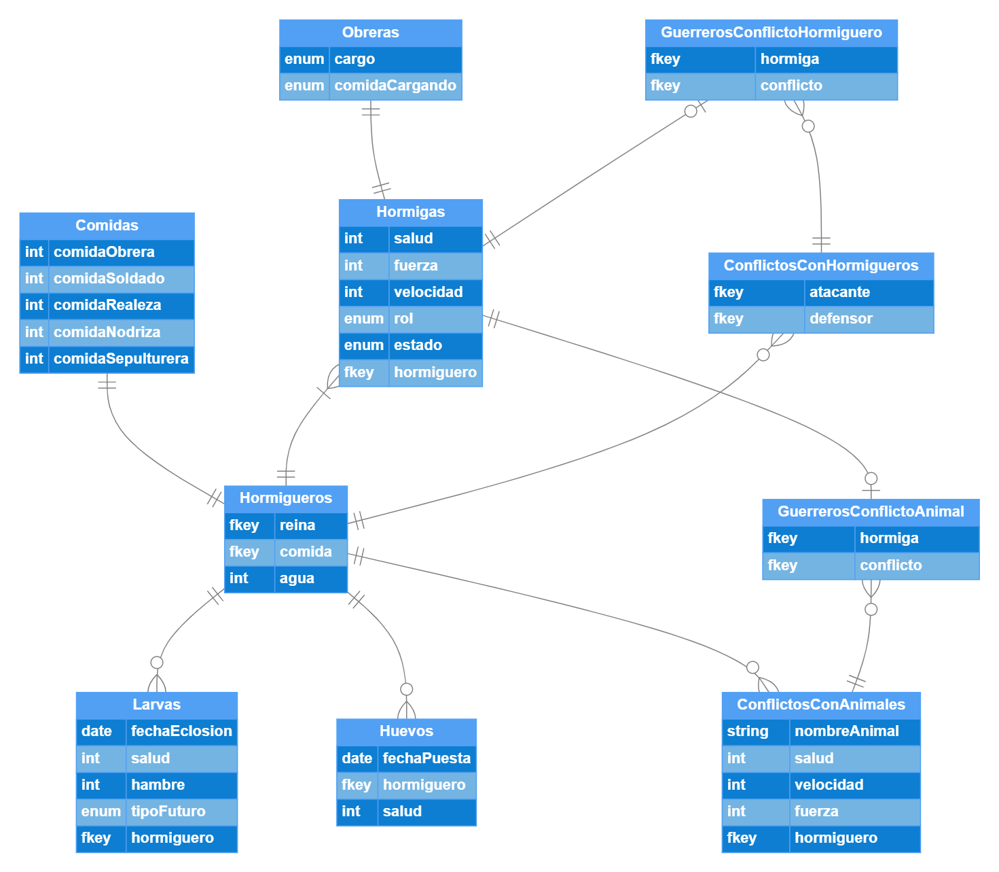

# Entrevista ICASS

## Diagrama entidad relación

Para poder realizar este diagrama se deben considerar quienes son las entidades que representan a los actores del sistema y cuales son las acciones que estos pueden realizar.
En este caso para la simulacion considere las siguientes acciones relevantes para la simulacion:

1. Las nodrizas deben poder alimentar a las larvas. El alimento condiciona que tipo de hormiga se convertira la larva.
   - Esto requiere que las nodrizas puedan identificar que tipo de larva es, cuanta hambre tiene y que tipo de comida necesita.
2. Los soldados deben poder pelear con animales y otras hormigas de diferentes hormigueros.
   - Para realizar esto, deben poder existir otros hormigueros con sus respectivas hormigas y tambien deben existir animales.
   - Para combatir estos deben tener ciertos atributos que les permitan ganar o perder en combate, como salud, fuerza y velocidad.
3. Las pricesas pueden crear nuevos hormigueros
    - De nuevo nos indican que el hormiguero no necesariamente es unico.
4. Las reinas pueden poner huevos
   - Esto nos exige que se puedan crear nuevas hormigas
   - Tambien, que estos huevos tengan un tiempo de incubación
5. Las obreras pueden recolectar comida
   - Deben tener la capacidad de transportar la comida al hormiguero
   - Deben poder identificar si hace falta comida en el hormiguero
6. Las obreras pueden explorar en busqueda de comida
   - Debe haber un subconjunto de hormigas obreras con diferente cargo que se dediquen a explorar

Con respecto a las entidades, notemos que en general no es necesario distinguir entre cada tipo de hormiga por lo cual tenemos una entidad `Hormiga` que representa a todas las hormigas.

- `Hormigas` tiene atributos generales como `salud`, `fuerza` y `velocidad`. El atributo `rol` nos permite distinguir entre los diferentes tipos de hormigas y el atributo `estado` nos permite saber que esta haciendo la hormiga en un momento dado. Este estado depende de cada tipo de hormiga. Por utlimo, el atributo `hormiguero` nos permite saber a que hormiguero pertenece la hormiga.
- `Comidas` indica la cantidad de comida de obrera, soldado, nodriza, etc. que existe en el hormiguero.
- `Hormigueros` tiene atributos como `comida` que nos indica la entidad `comidas`. EL hormiguero tiene una unica reina que es una foreign key a la entidad `Hormigas`. Ademas, el hormiguero tiene el atributo `agua` que indica la cantidad de agua que tiene el hormiguero, siendo una unidad arbitraria.
- `Obreras` sirve para ejecutar la 6ta accion. Tiene un atributo `cargo` que nos indica si la hormiga es exploradora o recolectora.
- `Larvas` y `Huevos` estan separados de hormigas porque tienen propiedades muy particulares. Un huevo, no puede pelear, por lo que no necesita tener fuerza o velocidad, pero si puede morir por lo que necesita tener salud. Tambien en necesario saber cuando se convierte en larva. Por otro lado, una larva no puede recolectar comida, pero si puede ser alimentada. Por lo que necesita tener hambre y segun la comida se le asigna un tipo de hormiga que se convertira en el futuro. La `fechaEclosion` sirve para saber cuando se convierte en hormiga.
- `ConflictosConHormigueros` y `ConflictosConAnimales` son entidades que nos permiten saber que hormigueros o animales estan en conflicto con un hormiguero en particular. En cada conflicto hay guerreros, estos guerreros solo pueden estar en un conflicto a la vez. Los conflictos con animales tambien nos deben indicar que animal es y para no complicarnos con el modelamiento, este tendra las mismas propiedades de combate que tienen las hormigas (salud, fuerza y velocidad). Las entidades `GuerrerosConflictoHormiguero` y `GuerrerosConflictoAnimal` nos permiten saber que hormigas o animales estan en un conflicto en particular.
- El rol de la `sepulturera` va a ser eliminar de la base de datos las hormigas muertas. Para no tener conflictos con cuenta de hormigas soldado muertas para su retirada tactica, se debe eliminar de la base de datos las hormigas muertas si y solo si, el conflicto ha terminado.



### Consultas SQL con acciones relevantes

1. **Retirada tactica** - Las hormigas soldado se retiran si mas del 50% de las hormigas en un conflicto han muerto. Para saber si deben retirarse podemos hacer la siguientes consultas:

```sql
SELECT COUNT(*)
FROM Hormigas, GuerrerosConflictoHormiguero
WHERE GuerrerosConflictoHormiguero.conflicto = 1
  AND Hormigas.id = GuerrerosConflictoHormiguero.hormiga
  AND Hormigas.salud = 0;
```

Obtener el total de soldados muertos en un conflicto.

```sql
SELECT COUNT(*)
FROM GuerrerosConflictoHormiguero
WHERE conflicto = 1;
```

Obtener el total de soldados en un conflicto.

Aqui nos tomamos la libertad de asumir que el id del conflicto es 1 y que es un conflicto con hormigueros.

2.**Sepultando cadaveres** - La sepulturera debe eliminar las hormigas muertas de la base de datos. Una hormiga esta muerta si su salud es 0. Para sepultar a una hormiga en particular, esta no debe estar involucrada en un conflicto. Asumiendo que estamos trabajando con el hormiguero 1, podemos hacer la siguiente consulta:

```sql
DELETE FROM Hormigas
WHERE hormiguero = 1
  AND salud = 0
  AND NOT EXISTS (
    SELECT *
    FROM GuerrerosConflictoHormiguero, GuerrerosConflictoAnimal
    WHERE GuerrerosConflictoHormiguero.hormiga = Hormigas.id
      OR GuerrerosConflictoAnimal.hormiga = Hormigas.id
  );
```

3. **Alimentando a las larvas** - Las nodrizas deben alimentar a las larvas. Para saber a que larvas de alimentar la nodriza de id 1, podemos hacer la siguiente consulta:

```sql
SELECT *
FROM (SELECT Hormigueros.id as id
  FROM Hormigueros, Hormigas
  WHERE Hormigas.id = 1
    AND Hormigueros.id = Hormigas.hormiguero
  ) as HormigueroNodriza, Larvas
WHERE Larvas.hormiguero = HormigueroNodriza.id;
```

## Estructuras de datos

A continuacion les presento una lista de situaciones o acciones que se pueden modelar con alguna estructura de datos.

- Alimentar a las larvas: Podemos modelar las larvas como una cola de prioridad, donde la prioridad sería una combinación de la cantidad de hambre que tiene la larva y el tipo de comida que necesita (esto ya que como se mencionó, existen ciertos porcentajes que se deben cumplir en cuanto al tipo de comida de las larvas)
- Los rastros de feromonas los podemos modelar como un grafo, donde los nodos son las posiciones en el mapa y las aristas son las feromonas que se dejan en el camino. Esto dado que se menciona que las hormigas no se desvían de su camino si encuentran feromonas de su hormiguero.

## Metodologías ágiles

Para el desarrollo de este proyecto, se puede utilizar la metodología Scrum. Realizaremos tres sprints los cuales se detallan a continuación:

### Sprint 1

- **Objetivo**: Crear la base de datos en psql con las entidades, relaciones y validaciones necesarias. Implementar el ORM SQLAlchemy. Implementar lógica base del simulador. Dockerizar el proyecto.

- **Historias de usuario**:
  - Como desarrollador, quiero tener una base de datos en psql con las entidades necesarias y validaciones necesarias para implementar funcionalidades.
  - Como desarrollador, quiero tener un archivo de configuración de docker-compose para poder levantar el proyecto de manera sencilla.
  - Como desarrollador, quiero tener un ORM para poder interactuar con la base de datos.
- **Tareas**:
  - Crear las entidades en psql.
  - Crear el archivo de configuración de Docker.
  - Implementar el ORM SQLAlchemy.
- **Duración**: 1 día.
- **Participantes**: 2 desarrolladores, realizando pair programming.

### Sprint 2

- **Objetivo**: Las hormigas han de ser capaces de luchar con animales y entre otras hormigueros, tambien deben poder recolectar y almacenar comida. Crear las clases y métodos necesarios para poder simular el comportamiento de las hormigas. Realizar pruebas unitarias.

- **Historias de usuario**:
  - Como desarrollador, quiero la capacidad de alterar estados de las entidades(salud, hambre, comida) utilizando metodos que permitan luchar, recolectar comida y almacenar comida.
- **Tareas**:
  - Crear los métodos luchar, recolectar, almacenar.
  - Creat tests unitarios.
- **Duración**: 1 días.
- **Participantes**: 2 desarrolladores.

### Sprint 3

- **Objetivo**: Las hormigas deben poder explorar en busca de comida, las nodrizas deben poder alimentar a las larvas, las reinas deben poder poner huevos y las princesas deben poder crear nuevos hormigueros. Realizar pruebas unitarias.
- **Historias de usuario**:
  - Como desarrollador, quiero tener los métodos necesarios para que las hormigas puedan explorar en busca de comida.
  - Como desarrollador, quiero tener los métodos necesarios para que las nodrizas puedan alimentar a las larvas.
  - Como desarrollador, quiero tener los métodos necesarios para que las reinas puedan poner huevos.
  - Como desarrollador, quiero tener los métodos necesarios para que las princesas puedan crear nuevos hormigueros.
- **Tareas**:
  - Crear los métodos necesarios.
  - Realizar pruebas unitarias.
  - Documentar el código.
  - Realizar pruebas de integración.
  - Realizar pruebas de aceptación.
  - Realizar despliegue.
- **Duración**: 2 días.
- **Participantes**: 3 desarrolladores.


## Realizacion de sprint 1

Como se puede apreciar en el codigo presentado, se logra dockerizar la simulacion, se crea la base de datos en psql de manera parcial, se implementa el ORM SQLAlchemy. Se logra hacer una simulacion donde en cada paso la reina agrega un huevo al hormiguero. Respecto al tiempo, este avance lo logré realizar en 1 día, sin embargo, esto se debe a que no tenia famialiridad con el ORM SQLAlchemy y por lo que tuve que investigar como implementarlo.

Para ejecutar la simulacion se debe tener instalado docker y correr el siguiente comando:

```bash
docker compose up
```

Para observar la base de datos se puede correr el siguiente comando:
  
```bash
docker exec -it db bash
psql -U postgres
SELECT * FROM huevos;
```

Los datos se encuentran guardados en la base de datos `postgres`